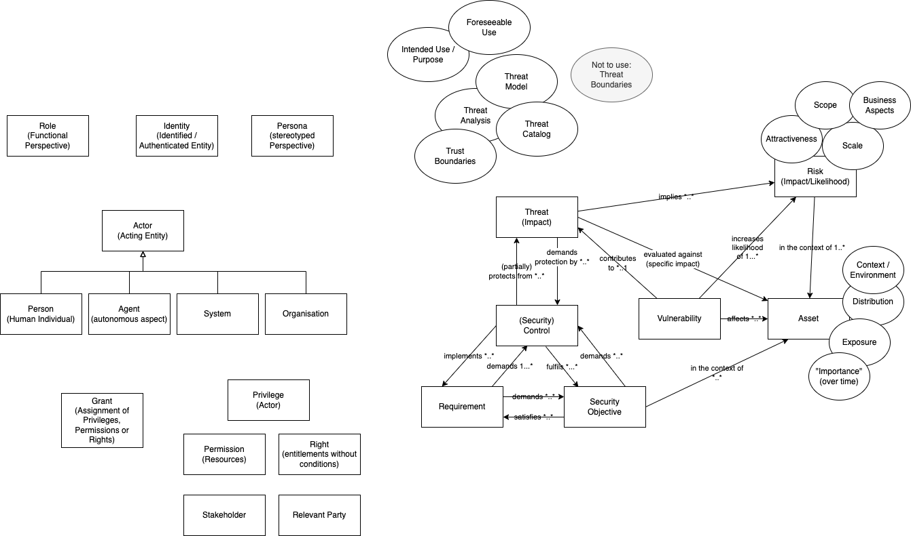

# SPDX Threats and Controls Team Meeting 2026-02-09

## Attendees

- Raymond Sheh
- Victor Lu
- Rithikha Rajamohan
- Brin Curcaneanu
- Greg Shue
- Nicole Pappler
- Alfred Strauch
- Steven Carbno
- Karsten Klein

## Agenda

- Clarification of current modelling in SPDX model (postponed)
- Risk Discussion (postponed)
- Model discussion regarding roles, identities, privileges (see ) 

## Notes

- Proposal to raise discussion in tech meeting.

## Agenda Item Proposals

- Revisit postponed items

## References

- https://basic-formal-ontology.org/
- https://www.nist.gov/system/files/documents/2021/10/14/nist-ai-rfi-cubrc_inc_004.pdf
- https://pmc.ncbi.nlm.nih.gov/articles/PMC7071388/
- https://github.com/spdx/spdx-spec/pull/1356/changes

