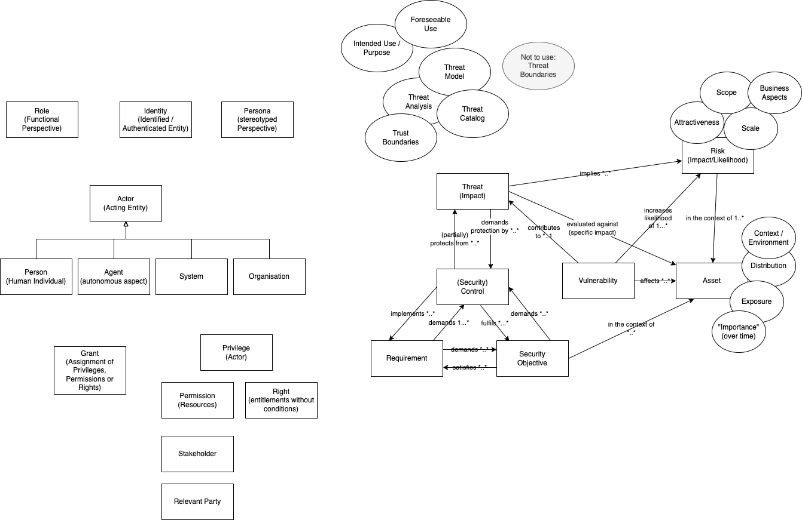

# SPDX Threats and Controls Team Meeting 2026-02-16

## Attendees

- Raymond Sheh
- Victor Lu
- Brin Curcaneanu
- Greg Shue
- Nicole Pappler
- Alfred Strauch
- Steven Carbno
- Karsten Klein

## Agenda

- Clarification of current modelling in SPDX model
- Risk Discussion; see 
- Model discussion regarding roles, identities, privileges (see [2026-02-09-Terminology-Discussion.png](2026-02-09-Terminology-Discussion.png)) 

## Notes

- Proposal to raise role discussion in tech meeting.

## Agenda Item Proposals

- Risk quantification. See A FAIR Taxonomy for Cyber Risk Scenarios 

## References

- https://www.fairinstitute.org/hubfs/FAIR%20CRM%20Body%20of%20Knowledge/FAIR%20Institute%20--%20Cyber%20Risk%20Scenario%20Taxonomy%20(February%202025).pdf
- https://arxiv.org/pdf/2407.14981
